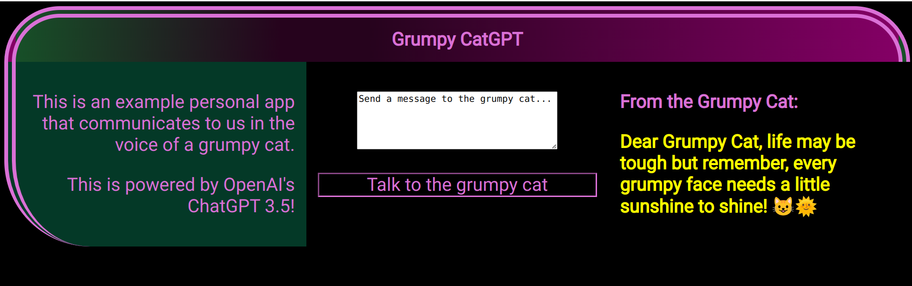

# Code-A-Long: Grumpy CatGPT

## Objectives

 - Be able to provide a high level overview of how applications incorporate popular API's.
 - Be able to modify and edit a codebase to perform a custom behavior.

This project contains the starting point used to create the grumpy cat GPT.

It's really hard to code and watch at the same time, which is why this repository exists. Now that you've seen it call come together, give it a try yourself and use this project as a starting point. Once you've got things up and running, ,ake it your own, and change things around, turn this in to a happy puppy app, or something else!

**Side note:** If you don't feel quite up for it, or feeling like you're needing a lot more foundational knowledge before digging in, fret not! We have lots of resources to help you get off the ground and more! Please reach out for more info.

## Technologies Used

## Pre-flight checklist

In order to get started you'll need a few things:
 - Github Account
 - An OpenAI API Key, Org Key
 - NodeJS Installed
   -  [Windows Users can use this guide](https://learn.microsoft.com/en-us/windows/dev-environment/javascript/nodejs-on-wsl)
  
Highly Recommended:
 - Code Editor such as VSCode
 - Familiarity with a command-line shell e.g. Bash

## Get Started

 - Replace the keys in `openai-test.js` configuration object with your own.
 - In your shell `npm start`.
 - In your browser, goto `localhost:3000`

